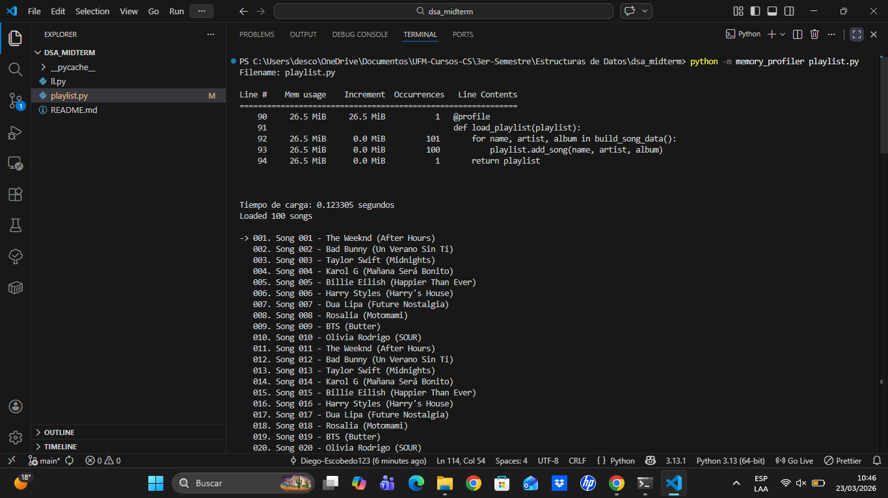
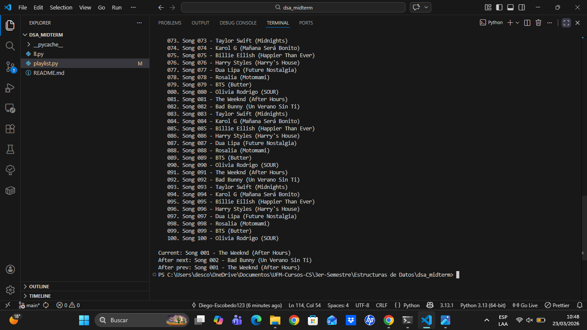

# dsa_midterm

Este trabajo implementa una playlist de música usando una lista doblemente enlazada no circular. La estructura permite navegar entre canciones hacia adelante y hacia atrás de forma ordenada.

## Profiling de carga de datos

El método de carga de datos fue perfilado con `memory_profiler` usando el decorador `@profile`. También se midió el tiempo total de ejecución con `perf_counter()`. Esto permite analizar cuánto tarda en cargar la playlist y cuánta memoria consume durante ese proceso.

El resultado muestra un crecimiento lineal en memoria y tiempo, porque cada canción agregada crea un nuevo nodo. Por eso, la complejidad temporal y espacial del método es O(n).

## Funcionalidad Shuffle

La funcionalidad shuffle permite reproducir las canciones en orden aleatorio. Puede activarse y desactivarse en cualquier momento, y cuando está activa la navegación se hace sobre un orden aleatorio generado desde los nodos de la lista.

Su complejidad es O(n) al generar el orden aleatorio y O(1) para avanzar o retroceder entre canciones una vez creado ese orden.

## Instrucciones de uso

Primero se debe clonar el repositorio con `git clone <dsa_midterm>` y entrar a la carpeta con `cd <dsa_midterm>`. Después, se instala `memory_profiler` con `pip install memory_profiler`. El programa se ejecuta con `python playlist.py`, y para ver el profiling de memoria se usa `python -m memory_profiler playlist.py`. Para clonar el repositorio se debe poner el siguiente comando: git clone https://github.com/Diego-Escobedo123/dsa_midterm.git

## Estructura del trabajo

El trabjo está compuesto por `ll.py`, donde está la lista doblemente enlazada; `playlist.py`, donde está la lógica de la playlist, la carga de datos, el profiling y el shuffle; y `README.md`, donde está esta documentación.

## Capturas de pantalla

## Conclusión

El proyecto usa una estructura de datos eficiente para simular una playlist real y añade análisis de memoria, tiempo y shuffle de forma práctica.